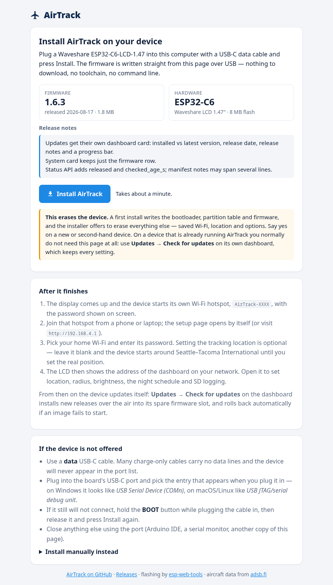

# AirTrack

AirTrack is self-contained firmware for the Waveshare ESP32-C6-LCD-1.47. It
connects to Wi-Fi, requests nearby traffic from adsb.fi, and shows the closest
fresh aircraft to a configured fixed location on the 172 x 320 display and a
local web dashboard.

This tree targets the connected ESP32-C6FH8 revision with 8 MB embedded flash
and no PSRAM. Verify the flash capacity before installing it on another board
revision. AirTrack is an enthusiast display, not a receiver, navigation aid,
or collision-warning device.

A finished build installs straight from
<https://skitty4fingers.github.io/AirTrack/flash.html> over USB, with no
toolchain; after that the device updates itself from its own dashboard. See
[Install](#install).

## Screens

Rendered from the current firmware: the LCD frames come from
`tools/host_ui_render/render.sh` (the real LVGL UI code drawn on the host at
2x), the dashboard captures are headless-Chromium screenshots of the live
device, and the installer is captured from the published page. Design
references are in [`docs/ui/`](docs/ui/).

**Device** — single-flight focus with route and ETA, no recent reports, Wi-Fi
lost, and setup (network names, addresses, and coordinates in all images are
sample values):


**Dashboard** (`http://<device-ip>/` or `http://airtrack.local/`), desktop and
phone widths, captured from a device running 1.6.3 (network name, address, and
coordinates are stand-ins):

<p>
  
  
</p>

**Setup portal** (captive page on the `AirTrack-xxxx` hotspot) and the
**HTTPS locate helper** (served from this repo's GitHub Pages) that hands your
browser's location back to the dashboard:

<p>
  
  
</p>

**Browser installer** (GitHub Pages), which writes the firmware to a blank
board over USB:

<p>
  
</p>

## Install

### From a browser

<https://skitty4fingers.github.io/AirTrack/flash.html> installs the current
release over USB with nothing to download and no toolchain. It needs Chrome,
Edge, or Opera on a desktop &mdash; Web Serial does not exist in Firefox,
Safari, or on phones &mdash; and a USB-C *data* cable. Plug the board in, press
**Install**, and pick the serial port that appears.

The page writes one merged factory image (bootloader, partition table, OTA
data, and firmware, at offset 0) using
[esp-web-tools](https://github.com/esphome/esp-web-tools), and offers to erase
the rest of the flash first; say yes on a new or second-hand board. When it
finishes, the device starts its `AirTrack-xxxx` setup hotspot, so continue from
a phone or laptop as with any fresh unit.

Two notes on how that page is hosted:

- esp-web-tools is vendored under
  [`docs/vendor/`](docs/vendor/esp-web-tools/) (Apache-2.0) rather than loaded
  from a CDN, so the page makes no third-party requests.
- The factory image is committed to [`docs/firmware/`](docs/firmware/) and
  served from GitHub Pages instead of being linked from the GitHub Release,
  because release assets are served without an `Access-Control-Allow-Origin`
  header and a browser cannot fetch them cross-origin.
  `tools/publish_release.sh` rebuilds it on every release and drops the
  previous one.

### Updating a device that already runs AirTrack

Use the dashboard, not the installer page &mdash; the installer erases stored
settings. Since 1.6.0 the **Updates** card checks
`docs/firmware/manifest.json` on GitHub Pages over HTTPS, shows the installed
and latest versions with the release notes, and installs into the spare OTA
slot with size and SHA-256 verification, keeping every setting. The bootloader
returns to the previous slot by itself if a new image fails its start-up
self-test. Releases are published with `tools/publish_release.sh`; see
[the OTA notes](docs/OTA_PLAN.md).

### From a workstation

Building and flashing over USB with ESP-IDF is described under
[Build, verify, and flash](#build-verify-and-flash). That is the path for
development, and the fallback when no Web Serial browser is available.

## Firmware status

The connected unit is running AirTrack 1.6.3.

Changes in 1.6.x:

- Over-the-air updates from the dashboard (1.6.0): manifest check, streamed
  download into the inactive slot, SHA-256 verification, automatic rollback.
- 1.6.3: updates get their own dashboard **Updates** card (installed against
  latest version, release date, release notes from the manifest, progress bar)
  and the System card keeps just the firmware row; `/api/v1/ota/status` adds
  `released` and `checked_age_s`, and manifest notes may run to several lines
  (up to 480 bytes). A browser installer on GitHub Pages
  ([`docs/flash.html`](docs/flash.html)) writes a merged factory image over Web
  Serial, so a blank board no longer needs a toolchain, and
  [`docs/index.html`](docs/index.html) gives the published site a front page.

Changes in 1.5.0:

- SD sighting log: choose how often a distinct aircraft may be logged again
  (30 minutes, hourly, every 6 hours, or daily); a **Clear log** button
  deletes every log file (`POST /api/v1/logs/clear`, CSRF-guarded).
- **Factory reset** next to Restart: erases the SD sighting log and every
  stored setting (Wi-Fi, location, options, and the setup-hotspot identity, so
  a new password is generated), then restarts into setup mode. Requires the
  CSRF token and typing `RESET` (`POST /api/v1/factory-reset`).
- Settings schema 4 (adds the sighting window); older records migrate.
- Setup portal restyled to match the dashboard, and the tracking location is
  now optional there: leave it blank and the device starts around
  Seattle&ndash;Tacoma International (SEA) as a placeholder, with a dashboard
  banner reminding you to set the real position.

Changes in 1.4.0:

- Night schedule (Display card): between two local times (default 23:00-07:00)
  the panel dims to a separate night brightness (default 5%) and, optionally,
  the status LED switches off. Requires a timezone: pick one from the preset
  list (the browser's zone is pre-selected when none is saved) or enter a
  POSIX TZ rule; the System card shows the device's local time and whether
  night mode is active. Settings schema 3; older records migrate.
- Log records and the top-five table now carry the route; a sighting is held
  up to 20 s so the lookup can land before the record is written.
- `/api/v1/config` returns the focus flight, retention, night schedule, and
  timezone; `/api/v1/status` adds `night` and `local_minutes`.

Changes in 1.3.0:

- Route enrichment: for each callsign in the tracked set the ADS-B worker asks
  `api.adsbdb.com` once (bounded 12-entry cache, one lookup per poll, unknown
  callsigns remembered for an hour) and shows origin/destination codes beside
  the compass on the LCD (`FROM` / `TO` columns) and in the dashboard.
- Track a single flight: a callsign, registration, or ICAO hex under
  *Location → Track a single flight* limits tracking to that aircraft; the LCD
  shows `WAITING FOR <flight>` until it reports in range, then its route,
  distance to go, and an ETA estimated from ground speed. Scheduled
  departure/arrival times are not available from any free source; wire a paid
  schedule API if you need on-time status.
- Location helper: *Use my location* (browser geolocation) and a paste box
  that accepts `lat, lon` or a maps link with `@lat,lon`. Because browsers only
  share location on HTTPS pages, the button hands off to
  [`docs/locate.html`](docs/locate.html), served over HTTPS from GitHub Pages at
  <https://skitty4fingers.github.io/AirTrack/locate.html>; that page reads the
  position once and navigates back to the dashboard with `?lat=&lon=` filled
  in (only home-network return addresses are accepted).
- Accessory LED mirrors the display: blue while the feed is healthy, orange
  when connecting, stale, offline, or in setup.
- SD sighting log: every distinct aircraft entering the tracked set is written
  once per 30 minutes (plus optional heartbeats); files are capped by the
  configurable size limit (MiB) and retention days, oldest files pruned first;
  the Storage card lists log files and shows the newest records inline with a
  download link (`GET /api/v1/logs`, `GET /api/v1/logs/<name>[?tail=N|download=1]`).
  Long FAT filenames are now enabled (they were required but off in 1.0.0).
- Settings schema 2 (adds the focus flight); schema 1 records migrate on load.

Changes in 1.2.0 (bringing the device and web UI in line with the concepts in
`docs/ui/`):

- LCD tracking screen redesigned after `device-states-concept-v2.png`: header
  with Wi-Fi glyph, feed dot, and last-update age; centred callsign with
  `TYPE • REG`; large `3.2 NM` distance; a compass gauge with N/E/S/W, ticks,
  a bearing arrow and highlight arc, and a plane silhouette rotated to the
  aircraft's track; icon rows for bearing, altitude, vertical rate, and speed;
  and a two-line footer. The no-reports state shows a slowly sweeping radar
  and `within 25 NM`; the setup screen shows `SCAN TO CONNECT`, a larger QR,
  and amber SSID / password / address.
- LAN dashboard rebuilt after `web-configurator-concept.png`: light theme,
  sidebar (Dashboard / Location / Display / Storage / System), status bar
  (ONLINE, Wi-Fi, API state, updated-ago), a nearest-aircraft card with a
  live SVG compass and the five nearest aircraft, and *editable* settings
  cards — search location, radius slider, airborne-only toggle, refresh
  interval, SD sighting log, brightness slider, units — with a Save button
  that applies changes immediately (no restart), plus a System card with
  diagnostics and a Restart button. CSS/JS are real files under
  `components/web/assets/` embedded at build time.
- Policy change: tracker/display settings can now be changed from the LAN
  dashboard at any time (CSRF token + canonical-Host + content-type checks),
  not only once while unconfigured. Wi-Fi credentials remain changeable only
  from the isolated setup hotspot.

Changes in 1.1.0:

- the ADS-B worker keeps one HTTPS connection alive between polls instead of
  performing a full TLS handshake every few seconds (one TLS session per
  network session; ~10 KiB more free heap, faster polls, less load on
  adsb.fi);
- the published feed state no longer flickers LIVE/STALE around every request,
  and position age is measured from the last successful poll;
- losing the saved Wi-Fi now opens a *recovery* setup hotspot while the station
  keeps retrying in the background (every 20 s), and tracking resumes
  automatically once the network is back; a BOOT hold in setup mode restarts
  the device;
- redesigned LCD: 28 px callsign, 40 px distance, north-up bearing arrow with
  cardinal, altitude / vertical speed / ground speed / squawk grid, emergency
  highlighting, freshness line, and a footer with Wi-Fi state, RSSI, and the
  full IPv4 address;
- the LAN dashboard refreshes itself every 2 s from the JSON API and lists the
  five nearest aircraft; `/api/v1/aircraft` now carries squawk, category,
  emergency, unit, radius, and per-aircraft age; `/api/v1/status` reports poll
  and TLS-connection counters and SD logging state;
- the setup portal pre-fills the saved SSID, location, and radius (never the
  password) and exposes units, brightness, poll interval, ground filter, and SD
  logging under "Display & feed options";
- station RSSI is refreshed every 5 s instead of only at DHCP time;
- `tools/host_ui_render/render.sh` renders every LCD screen on the host so the
  layout can be reviewed without the hardware.

The implemented core includes:

- one serialized SPI2 bus shared safely by the ST7789 LCD and optional SD card;
- a portrait LVGL interface using two bounded 20-line DMA buffers;
- a backlight hard-limited to 50 percent;
- persistent CRC-protected A/B tracker settings and separately stored Wi-Fi
  credentials;
- a per-device WPA2 setup hotspot, Wi-Fi QR, captive portal, and selectable
  scan of up to 16 nearby networks;
- fixed location and 1-250 NM radius setup from the local web interface;
- automatic recovery setup after 60 seconds without the saved Wi-Fi, plus a
  five-second BOOT-button shortcut;
- a verified-HTTPS adsb.fi client with a bounded streaming parser, top-five
  ranking, freshness/ground filters, target hysteresis, rate limiting, and
  retry backoff;
- live, empty, stale, offline, and configuration-required LCD states, with the
  complete SSID and IPv4 address retained in the footer;
- a station-LAN dashboard at the address shown on the LCD and at
  `http://airtrack.local`, when mDNS is supported by the client, with
  editable tracker/display settings and a restart button;
- bounded JSON at `/api/v1/status`, `/api/v1/config`, and
  `/api/v1/aircraft`;
- SNTP time synchronization and optional bounded NDJSON logging to FAT32 SD;
  and
- host parser/tracker tests plus a repeatable security, filesystem, build,
  image-size, and artifact-hash release gate.

On the connected unit the setup SSID is `AirTrack-8134`. Its eight-character
password is shown only on the LCD and encoded in the QR. It is not returned by
the LAN API or written to logs.

If Wi-Fi is already configured but the tracking location is not, open the
numeric address shown at the bottom of the LCD and enter the actual fixed
latitude, longitude, and radius once. Afterward, hold BOOT for five seconds to
open the isolated setup hotspot when Wi-Fi or location/radius needs changing.

The current image is about 1.8 MB and leaves 55 percent of each 3,904 KiB OTA
app slot free.

## Build, verify, and flash

Use ESP-IDF 5.5.5:

```sh
source /home/skitty/esp/esp-idf-v5.5.5/export.sh
./tools/check_release.sh
idf.py -B build-production -p /dev/ttyACM0 flash monitor
```

The release check runs host tests, verifies the secure transport and
non-formatting SD policies, builds the production image, enforces the image
budget, and prints SHA-256 hashes. Flashing does not erase the NVS partition;
do not run `erase-flash` when preserving configured Wi-Fi and settings.

To build the single-file image the browser installer writes &mdash; useful for
flashing another host with plain esptool &mdash; merge the four parts:

```sh
python3 -m esptool --chip esp32c6 merge_bin -o airtrack-factory.bin \
    --flash_mode dio --flash_size 8MB --flash_freq 80m \
    0x0 build-production/bootloader/bootloader.bin \
    0x8000 build-production/partition_table/partition-table.bin \
    0xf000 build-production/ota_data_initial.bin \
    0x20000 build-production/airtrack.bin
python3 -m esptool --chip esp32c6 -p /dev/ttyACM0 write_flash 0x0 airtrack-factory.bin
```

`tools/publish_release.sh` runs the same merge and commits the result under
`docs/firmware/`, which is what GitHub Pages serves to the installer page.

To review the LCD screens without the board, run
`tools/host_ui_render/render.sh` (needs a host C compiler and the `build/`
sdkconfig); it writes PNGs of every screen to `build-host-ui/`. To exercise the
Wi-Fi recovery round trip on a bench with the router still present, build once
with `AIRTRACK_TEST_FORCE_RECOVERY_MS=25000 idf.py -B build-recovery-test build`
and watch the serial log; never ship that image.

See [the firmware plan](docs/FIRMWARE_PLAN.md) for the architecture and
[the release checklist](docs/RELEASE_CHECKLIST.md) for target acceptance and
the remaining production sign-off tests.
